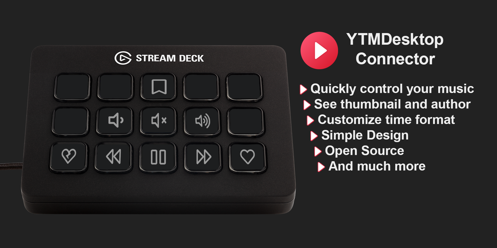

<div align="center">



# 🎵 PluginYoutubeDescktop YTMD Stream Deck

### Plugin avanzado para controlar YouTube Music Desktop desde Stream Deck 🚀

<p align="center">
  <b>YTMD Stream Deck</b> es un plugin diseñado para integrar Stream Deck con YouTube Music Desktop App, permitiendo controlar reproducción, volumen, información de canciones y funciones multimedia directamente desde el hardware Elgato Stream Deck.
</p>

<p align="center">
  
  
  
  
</p>

<p align="center">
  <a href="#-preview">Preview</a> •
  <a href="#-características">Características</a> •
  <a href="#-acciones-disponibles">Acciones</a> •
  <a href="#-tecnologías-utilizadas">Tecnologías</a> •
  <a href="#-instalación">Instalación</a>
</p>

</div>

---

# 🌌 Acerca de YTMD Stream Deck

**YTMD Stream Deck** permite controlar la aplicación **YouTube Music Desktop App** directamente desde dispositivos Stream Deck mediante integración con el Companion Server.

El plugin ofrece:

- 🎵 Control multimedia completo
- ▶️ Reproducción y pausa
- ⏭️ Navegación entre canciones
- 🔊 Gestión de volumen
- ❤️ Like y dislike de canciones
- 📊 Información dinámica del track
- 🔀 Shuffle y Repeat
- 🎧 Visualización de miniaturas

Está enfocado en usuarios que desean una experiencia multimedia profesional y automatizada utilizando Stream Deck.

---

# 📸 Preview

<div align="center">


</div>

---

# ✨ Características

# 🎵 Control Multimedia

- ▶️ Play / Pause
- ⏭️ Next Track
- ⏮️ Previous Track
- 🔀 Shuffle
- 🔁 Repeat modes
- 🔊 Control de volumen
- 🔇 Mute instantáneo

---

## ❤️ Gestión de Canciones

- 👍 Like Track
- 👎 Dislike Track
- 🎧 Información dinámica
- 🖼️ Thumbnail de canciones
- 📜 Texto desplazable automático

---

## 📊 Información en Tiempo Real

- 🎵 Nombre de canción
- 👤 Artista
- 💿 Álbum
- 🖼️ Carátula del track
- ⚡ Actualización dinámica

---

## ⚙️ Integración Companion Server

- 🌐 Comunicación en tiempo real
- 🔐 Autorización segura
- ⚡ Conexión directa con YTMDesktop
- 🎧 Sincronización multimedia

---

# 🎛️ Acciones Disponibles

## 🎶 Playback Controls

- ▶️ Play / Pause
- ⏭️ Next
- ⏮️ Previous
- 🔀 Shuffle
- 🔁 Repeat ALL / ONE / NONE

---

## 🔊 Audio Controls

- 🔇 Volume Mute
- 🔉 Volume Down
- 🔊 Volume Up

---

## 📊 Track Information

- 🖼️ Miniatura de canción
- 🎵 Información de reproducción
- 📜 Texto dinámico desplazable
- ⚡ Estado multimedia en tiempo real

---

# 🌐 Compatibilidad

## 📱 Requisitos

- YouTube Music Desktop App v2.x.x o superior
- Stream Deck
- Companion Server habilitado
- Sistema operativo compatible con Stream Deck

---

# 🛠️ Tecnologías Utilizadas

## ⚡ Desarrollo Plugin

<p>
  
</p>

- TypeScript
- JavaScript
- Node.js
- NPM

---

## 🔧 Herramientas y Servicios

<p>
  
</p>

### Tecnologías principales

- Stream Deck SDK
- Companion Server
- WebSocket Communication
- YouTube Music Desktop API

---

# 📂 Estructura del Proyecto

```bash
PluginYoutubeDescktop/
│
├── assets/                  # Recursos gráficos
├── actions/                 # Acciones Stream Deck
├── ui/                      # Interfaces y settings
├── integrations/            # Companion Server
├── docs/                    # Documentación
├── package.json
├── tsconfig.json
└── README.md
```

---

# ⚡ Instalación

## 1️⃣ Instalar YouTube Music Desktop

Descarga e instala:

```bash
https://github.com/isairey/PluginYoutubeDescktop
```

---

## 2️⃣ Instalar el Plugin

- 📦 Desde GitHub Releases
- 🛒 Desde Stream Deck Store

---

## 3️⃣ Configurar Companion Server

### Dentro de YTMDesktop

1. Abrir configuración ⚙️
2. Entrar a "Integrations"
3. Activar "Companion Server"
4. Activar autorización
5. Guardar configuración

---

## 4️⃣ Autorizar Plugin

- 🔐 Presiona "Authorize"
- 📲 Verifica el código mostrado
- ✅ Confirmar autorización
- 🚀 Plugin listo para usar

---

# 🔥 Funcionalidades Técnicas

## ⚡ Comunicación en Tiempo Real

- WebSockets
- Companion API
- Actualización instantánea
- Eventos multimedia dinámicos

---

## 🎧 Multimedia Integration

- Streaming control
- Track metadata
- Dynamic thumbnails
- Media synchronization

---

## 🔒 Seguridad

- Companion authorization
- Secure pairing
- Validación de códigos
- Comunicación protegida

---

# 🧠 Objetivos del Proyecto

## 🎯 Aprender y practicar

- Stream Deck SDK
- Integraciones multimedia
- Companion APIs
- Comunicación WebSocket
- Desarrollo TypeScript
- Automatización multimedia
- Plugins desktop
- Sistemas de control multimedia

---

# 📊 Roadmap

## 🚧 Próximamente

- 🌙 Dark UI avanzada
- 🎵 Lyrics integration
- ❤️ Favorite playlists
- ☁️ Cloud synchronization
- 📱 Companion mobile app
- 🎧 Audio visualizer
- 🔥 Custom themes
- ⚡ Optimización de rendimiento

---

# 🤝 Contribuciones

Las contribuciones son bienvenidas ❤️

## Cómo contribuir

1. Haz Fork del proyecto
2. Crea una rama

```bash
git checkout -b feature/nueva-funcion
```

3. Realiza cambios
4. Haz commit

```bash
git commit -m "✨ Nueva funcionalidad"
```

5. Haz push

```bash
git push origin feature/nueva-funcion
```

6. Abre un Pull Request 🚀

---

# ⚙️ Release System

## 🔥 Conventional Commits

El proyecto utiliza:

- release-please
- Conventional Commits
- Automatización de releases
- Versionado semántico

---

# 👨‍💻 Autor

<div align="center">

## XeroxDev

Developer enfocado en automatización, plugins multimedia y herramientas avanzadas para Stream Deck.

</div>

---

# 🌟 Apoya el Proyecto

Si te gusta YTMD Stream Deck:

⭐ Dale una estrella al repositorio  
🍴 Haz Fork del proyecto  
📢 Compártelo con otros desarrolladores

---

# 📜 Licencia

Proyecto Open Source enfocado en automatización multimedia y productividad.

---

<div align="center">

### 🎵 PluginYoutubeDescktop YTMD Stream Deck — Control total de YouTube Music desde Stream Deck.

</div>
